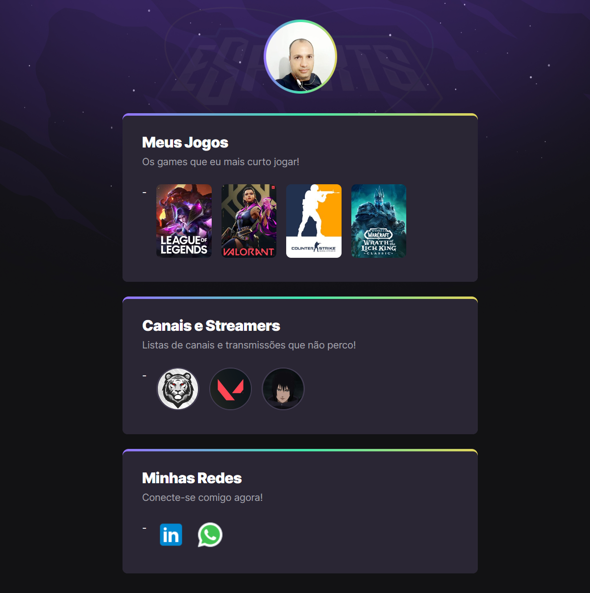

# NLW eSports

  

> Trilha Explorer

 🔗 [clique aqui para acessar](https://prdsilva80.github.io/nlw-eSports-explorer/)

Projeto construído no evento Next Level Week da Rockeseat.

## 🛠️ Tecnologias

 
    
  
  
  
  

 

## 👨‍🎓 O que aprendi
- Buscar e adicinar imagens no HTML
- Entender o uso das Tags no HTML
- Fazer conexões entre o HTML e CSS
- Fazer animações no CSS

## 📧 Contato

<a href = "mailto:probertos717@gmail.com">